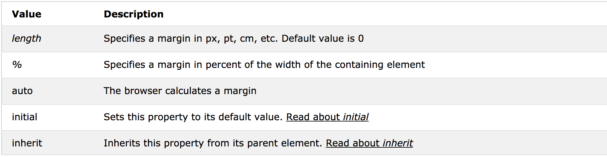

## CSS에 자주 사용되는 명령어들

#### CSS 참고 사이트 : https://www.w3schools.com/cssref/ (HTML등도 같이 있음)

1. 모든 태그에 사용되는 명령어

```CSS
background: 색상 or #색상코드; // 색을 넣는 것. 
#p_tag{
	background: #FFFFFF;
}
background: url('이미지 주소'); // 이미지를 넣는 것. - 요즘은 라이브러리 많이 갖다씀.
#p_tag{
	background: url('url');
}
background-size: auto|length|cover|contain|initial|inherit;

background-position: value;

background-repeat: repeat|repeat-x|repeat-y|no-repeat|initial|inherit;
// span 되지 않도록 여백있으면 이미지를 타일식으로 반복시킨다. 이걸 하냐 안하냐.

#example1 {
    background: url(mountain.jpg);
    background-repeat: no-repeat;
    background-size: auto;
}
```


#### background-size Property Values

{:.lead}


#### background-position Property Values

{:.lead}


#### background-repeast Property Values

{:.lead}


### 레이아웃

**CSS 디자인에서 가장 중요한 부분!!**

```CSS
display : block, inline, inline-block, none
// blocK 요소 : 한줄 다 먹는 태그
// inline 요소 : 텍스트만 감싸는 태그
=> 기본적으로 각 태그마다 default 옵션이 지정되어있다. 이걸 CSS로 수정가능
p.ex1 {display: none;}
p.ex2 {display: inline;}
p.ex3 {display: block;}
p.ex4 {display: inline-block;}

height

width

padding: length|initial|inherit; 
// display 다음으로 중요한 값!
// border 안쪽에 적용됨
p {
    padding: 2cm 4cm 3cm 4cm;
}

border: border-width border-style border-color|initial|inherit;
// background가 적용되는 기준. 테두리라고 생각

h1 {
    border: 5px solid red;
}

h2 {
    border: 4px dotted blue;
}

div {
    border: double;
}

margin: length|auto|initial|inherit;
// border 바깥쪽에 적용됨
// background는 마진에 적용되지 않는다. border까지만 적용

p {
    margin: 2cm 4cm 3cm 4cm;
}

* 컨텐츠의 크기는 border까지 값들을 더한것.

```


#### display  Property Values

{:.lead}

-> 얘를 잘 이용하면 메뉴바같은것도 만들 수 있다.

* inline 같은 경우에는 width, height등으로 강제적으로 영역크기 조정불가. 컴포넌트 크기에 의해 강제된다. 
* inline-block : 위의 경우에서 강제되는것을 막기위해 사용함. 그리고 옆의 태그에 달라붙는다. 
  -> 그래서 보통은 inline 보다는 inline-block을 많이사용한다. 


#### padding Property Values

- padding:10px 5px 15px 20px;

  - top padding is 10px
  - right padding is 5px
  - bottom padding is 15px
  - left padding is 20px

  ​

- padding:10px 5px 15px;

  - top padding is 10px
  - right and left padding are 5px
  - bottom padding is 15px

  ​

- padding:10px 5px;

  - top and bottom padding are 10px
  - right and left padding are 5px

  ​

- padding:10px;

  - all four paddings are 10px

{:.lead}


#### boader Property Values

0px solid 로 줘놓고 

```CSS
{
  border: 0px solid black;
  border-bottom-width: 3px;
  border-right-width: 1px;
  border-right-coloe: red;
}
```

이런식으로 부분부분만 적용시킬수도 있다(실무에서 쓰이는 꼼수)


{:.lead}


#### margin Property Values

**마진으로 가운데정렬** : text align은 컴포넌트의 크기를 기준으로 내부에서만 정렬되는 것. -> 요소 전체를 가운데 정렬되지는 않는다

=> magin: auto 로 정렬. auto는 가운데에 두는 것. 

- margin:10px 5px 15px 20px;

  - top margin is 10px
  - right margin is 5px
  - bottom margin is 15px
  - left margin is 20px

  ​

- margin:10px 5px 15px;

  - top margin is 10px
  - right and left margins are 5px
  - bottom margin is 15px

  ​

- margin:10px 5px;

  - top and bottom margins are 10px
  - right and left margins are 5px

  ​

- margin:10px;

  - all four margins are 10px

**Note:** Negative values are allowed.




### 포지션

display보단 덜하지만 굉장히 자주 쓰이는 속성

```CSS
position: static|absolute|fixed|relative|sticky|initial|inherit;

h2 {
    position: absolute;
    left: 100px;
    top: 150px;
}

```


#### position Property Values

* absolute : 다른 태그들 무시하고 자기위치로 감. 다른태그들 위치 계산할때 얘는 빠진다
  -> relative 로 배치할려다가 안될때 최후의 수단으로 쓰인다. (relative로 찍는게 제일 좋다.)
* absolute 포지션의 기준점은 가장 처음 만나는 상위의 relative 컴포넌트가 된다.

{:.lead}


### 테두리


```CSS
border

border-width

border-radius

```


### 그림자

사실 쉐도우를 직접 만질일은 많지 않다. 프레임워크, 라이브러리에서 알아서 적용됨. 적당히 바꾸고싶을때만

```CSS
box-shadow: none|h-offset v-offset blur spread color |inset|initial|inherit;

#example1 {
    box-shadow: 5px 10px;
}

#example2 {
    box-shadow: 5px 10px #888888;
}

#example1 {
    box-shadow: 5px 5px blue, 10px 10px red, 15px 15px green;
}

#example1 {
    box-shadow: 5px 10px inset;
}

div.polaroid {
    width: 284px;
    padding: 10px 10px 20px 10px;
    border: 1px solid #BFBFBF;
    background-color: white;
    box-shadow: 10px 10px 5px #aaaaaa;
}

div {
    width: 200px;
    height: 50px;
    line-height: 50px;
    text-align: center;
    color: white;
    background-color: red;
    margin: 10px;
}
div.a {
  box-shadow: 10px 10px 10px #000;
}
div.b {
  box-shadow: 10px 10px 10px rgba(0, 0, 0, 0.5);
}

```


#### box-shadow Property Values

{:.lead}


### 텍스트 속성

```CSS
font

font-size

font-weight

text-align

line-height: normal|number|length|initial|inherit;
// 야매로 vertical 설정할때 글간격 올리고내리면서 많이씀
p.small {
    line-height: 90%;
}

p.big {
    line-height: 200%;
}

color

white-space: normal|nowrap|pre|pre-line|pre-wrap|initial|inherit;
// <p>태그에서 자동줄바꿈이 되는데 이게 싫을때 혹은 자동줄바꿈이 안되는데 자동줄바꿈을 하고싶을때
=> 삐져나가는것을 어떻게 처리할 것인가에 대한 옵션
nowrap 옵션을 가장 많이 사용한다. 
p {
    white-space: nowrap;
}

```


### 오버플로


```CSS
overflow: visible|hidden|scroll|auto|initial|inherit;
//scroll : 영역 고정해놓고 스크롤바 생성
div {
    width: 150px;
    height: 150px;
    overflow: scroll;
}

overflow-x
//scroll 할때 세로축에 스크롤바 필요없을 때 가로축에만 적용

overflow-y

```


이미지 로딩할 때 용량 커서 꽤 오래걸리게 되면 로딩완료되고 세로스크롤바가 등장하는 순간 컨텐츠가 튀는 경우가 생긴다 -> overflow-y 로 명시적으로 스크롤바 만들어 놓으면 이런 경우를 방지할 수 있다.


## CSS Framework


* 기본적으로 CSS를 직접 사용하기보다는 프레임워크를 쓰는게 편하다. 
* 앞서 배운 CSS사용법들은 프레임워크를 커스터마이징할때 사용하는 것. 


### 대표적인 Framework

* Bootstrap


### 링크태그를 통해 CSS 불러오기 

```HTML
<link href="path/file.css" rel="stylesheet" type="text/css" />
```


